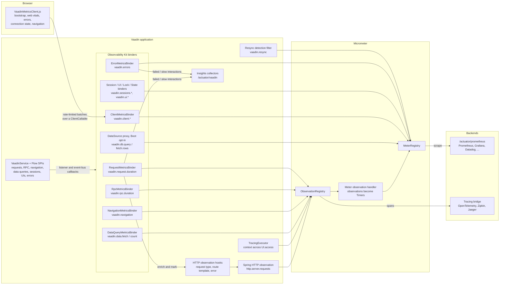

# Vaadin Observability Kit

Production telemetry for [Vaadin Flow](https://vaadin.com) applications, using
[Micrometer](https://micrometer.io). The kit instruments the Vaadin runtime —
sessions, UIs, navigation, requests, errors and real browser-side timing — and
records everything into your application's `MeterRegistry`, so it shows up in
whatever backend you already use (Prometheus, OTLP, Graphite, …). Tracing spans
are emitted through the Micrometer Observation API.

It is a drop-in: with Spring Boot you **add one dependency and you're done** — no
code, no annotations, no configuration required.

> Observability Kit is a commercial Vaadin product. See [License](#license).

## Requirements

- Java 21 or newer
- Vaadin 25.3 or newer (Flow 25.3+)
- A Micrometer `MeterRegistry` — the Spring Boot starter provides one out of the box
- Spring Boot 4 (only for the `observability-kit-starter`; plain-Spring and
  standalone setups are also supported)

## How it works

The kit is a plain library: no `-javaagent`, no bytecode weaving. At `VaadinService` initialization, `MetricsServiceInitListener` (a Spring/Boot bean, or loaded via `ServiceLoader` in standalone deployments) registers a set of binders on the Flow SPIs: session and UI lifecycle listeners, the request interceptor, the RPC and data-query events on `VaadinServiceEventBus`, navigation listeners, and a decorated session error handler. Each binder records into the application's `MeterRegistry` and, when tracing is on, drives an `Observation` through the `ObservationRegistry`. One observation produces both signals: the meter observation handler turns it into a Timer, and a tracing bridge (OpenTelemetry, Zipkin) turns it into a span. The service executor is wrapped in a `TracingExecutor`, so trace context follows work across `UI.access(...)` thread hops.

The kit also enriches telemetry the framework emits anyway: through its HTTP observation hooks, the Spring HTTP observation gets the Vaadin request type, the active view's route template as its `uri` tag (template-only, and budgeted to stay under Boot's `max-uri-tags` cap), and error status for failures Vaadin handles internally on a 200 response.

On the browser side, an injected collector gathers bootstrap timing, Web Vitals, client errors, connection state and navigation timing into a priority-ordered buffer, persisted to `sessionStorage` across outages and page closes, and ships batches to the server over a rate-limited `@ClientCallable`. Every sample is validated against a per-meter tag-key allowlist and bounded tag values before recording. Failed and slow interactions are additionally retained by the insights collectors and exposed at `/actuator/vaadin`, so a user report can be backtracked to the exact interaction.



## Getting started (Spring Boot)

Add the starter:

```xml
<dependency>
    <groupId>com.vaadin</groupId>
    <artifactId>observability-kit-starter</artifactId>
    <version>5.0-SNAPSHOT</version>
</dependency>
```

That's the whole setup. On startup the kit auto-configures a `MeterRegistry`
(through Spring Boot's Micrometer support) and wires the Vaadin instrumentation
onto it. Sessions, UIs, navigation, request handling, errors and client-side
timing all start recording automatically.

### Exposing the metrics

The kit *records* into a registry; to *export* the metrics, add Spring Boot
Actuator and the registry backend of your choice — for example Prometheus:

```xml
<dependency>
    <groupId>org.springframework.boot</groupId>
    <artifactId>spring-boot-starter-actuator</artifactId>
</dependency>
<dependency>
    <groupId>io.micrometer</groupId>
    <artifactId>micrometer-registry-prometheus</artifactId>
</dependency>
```

```properties
management.endpoints.web.exposure.include=prometheus
```

The metrics are then available at `GET /actuator/prometheus`.

## Working with the metrics in your application

Everything the kit records lives in the application `MeterRegistry`. You can read
it from anywhere a bean is injectable — including a Vaadin view — and record your
own meters right alongside the built-in ones:

```java
@Route("latency")
public class LatencyView extends VerticalLayout {

    private static final String SERVER_TIMER = "vaadin.request.duration";

    private final transient MeterRegistry registry;

    public LatencyView(MeterRegistry registry) {
        this.registry = registry;

        add(new Button("Do work", e -> timed("do-work", () -> doWork())));
        add(new Button("Show server timing", e -> {
            Timer timer = registry.find(SERVER_TIMER).timer();
            if (timer != null) {
                Notification.show("%d requests, max %.0f ms".formatted(
                        timer.count(), timer.max(TimeUnit.MILLISECONDS)));
            }
        }));
    }

    /** Record a custom timer next to the kit's built-in meters. */
    private void timed(String action, Runnable work) {
        Timer.Sample sample = Timer.start(registry);
        try {
            work.run();
        } finally {
            sample.stop(registry.timer("app.interaction", "action", action));
        }
    }
}
```

The built-in server-side request timer is `vaadin.request.duration`, and
server-side RPC invocations are timed as `vaadin.rpc.duration`. See
[Metrics](#metrics) for the full list.

## Other setups

### Plain Spring (without Spring Boot)

Add the Spring module, import the configuration, and provide a `MeterRegistry`
bean:

```xml
<dependency>
    <groupId>com.vaadin</groupId>
    <artifactId>observability-kit-spring</artifactId>
    <version>5.0-SNAPSHOT</version>
</dependency>
```

```java
@Configuration
@Import(ObservabilityConfiguration.class)
class ObservabilityConfig {

    @Bean
    MeterRegistry meterRegistry() {
        return new SimpleMeterRegistry();
    }
}
```

### Standalone (without Spring)

Add the core module and install the kit at servlet-context startup — for example
from a `ServletContextListener` — so the registry is in place before the
`VaadinService` initializes:

```xml
<dependency>
    <groupId>com.vaadin</groupId>
    <artifactId>observability-kit-micrometer</artifactId>
    <version>5.0-SNAPSHOT</version>
</dependency>
```

```java
@WebListener
public class ObservabilitySetup implements ServletContextListener {

    @Override
    public void contextInitialized(ServletContextEvent event) {
        MeterRegistry registry = new SimpleMeterRegistry();
        ObservabilityKit.install(registry,
                ObservabilitySettings.builder().build());
    }
}
```

## Configuration

Most features are enabled by default. The ones that reach beyond ordinary
request handling — database monitoring and UI state size — are opt-in, as are
the two that would add sensitive or high-cardinality detail to what is
exported (`database-statement`, `traces-session-id`); the table below gives
every default. With the Spring Boot starter, configure the kit through
`vaadin.observability.*` properties:

```properties
# Turn the whole kit off
vaadin.observability.enabled=false

# Or toggle individual feature groups
vaadin.observability.client=false
vaadin.observability.traces=false
```

| Property | Default | Description |
| --- | --- | --- |
| `vaadin.observability.enabled` | `true` | Master switch for the auto-configuration. |
| `vaadin.observability.sessions` | `true` | Session count, lifetime and lock metrics. |
| `vaadin.observability.uis` | `true` | UI count metrics. |
| `vaadin.observability.ui-state` | `false` | Per-UI state size: how much component-tree state the server holds for live users (see [UI state size](#ui-state-size)). |
| `vaadin.observability.navigation` | `true` | Navigation timing. |
| `vaadin.observability.requests` | `true` | Server-side request and RPC timing: the `vaadin.request.duration` and `vaadin.rpc.duration` meters and, when tracing is on, their spans. Error counting, error marking on the framework's own HTTP observation, and its enrichment are all unaffected. |
| `vaadin.observability.data` | `true` | Data provider count/fetch query timing and page sizes for lazy-loading components. |
| `vaadin.observability.errors` | `true` | Error counters. |
| `vaadin.observability.client` | `true` | Browser-side timing, connection state and errors collected from the client (see [Connection and client-side problems](#connection-and-client-side-problems)). |
| `vaadin.observability.resync` | `true` | Observe UIDL message resends and client-requested resynchronizations. |
| `vaadin.observability.database` | `false` | Wrap `DataSource` beans to record JDBC result-set sizes per route and (when tracing is on) emit a span per query (Spring Boot starter only). |
| `vaadin.observability.database-statement` | `false` | Attach the (parameterized) SQL as `db.statement` on the query span. Off by default since SQL is higher cardinality and may be sensitive. |
| `vaadin.observability.traces` | `true` | Emit tracing spans via the Observation API. |
| `vaadin.observability.traces-session-id` | `false` | Include the session id as a span attribute. |
| `vaadin.observability.insights` | `true` | Retain failed and over-budget user interactions, and the detail of errors browsers reported, so the insights endpoint can backtrack a user report to a replicable interaction. Requires `errors` for failures and `requests` for slow interactions; browser errors additionally require `client`. |
| `vaadin.observability.insights-details` | `false` | Allow retained interactions to carry the raw session id, exception message and top stack frames, and retained browser errors their message and the function name from their stack frame. Off by default since the insights payload is meant to be forwarded. For a browser error this governs collection, not just retention: unless it is on and something is there to retain a message, the browser never gathers one, so nothing to withhold is buffered or sent — see [Connection and client-side problems](#connection-and-client-side-problems). Read by a page when it loads, so a change reaches already-open tabs only after a reload. |
| `vaadin.observability.insights-capacity` | `100` | Maximum number of retained records per buffer — interactions, data provider queries and browser errors are capped separately; the oldest is evicted once the cap is reached. |
| `vaadin.observability.route-cardinality-limit` | `200` | Maximum number of distinct `route` tag values before they collapse to `_other`. Also caps the `component` and `exception` tag values of `vaadin.errors`. |
| `vaadin.observability.client-rate-per-session` | `100` | Maximum client-side samples accepted per session (throttling guard). |
| `vaadin.observability.ui-state-sample-interval` | `10000` | Minimum milliseconds between two measurements of the same UI. One measurement walks that UI's whole component tree under its session lock, so this is the knob that bounds the cost of the feature. |
| `vaadin.observability.ui-state-bytes-per-node` | `0` | Bytes per state-tree node used for `vaadin.ui.state.size`; `0` publishes no byte figure. |

For plain Spring the same keys are read via `@Value`; for standalone use, build an
`ObservabilitySettings` with the matching builder methods:

```java
ObservabilitySettings.builder()
        .client(false)
        .traces(false)
        .routeCardinalityLimit(500)
        .build();
```

## Metrics

| Meter | Type | Description |
| --- | --- | --- |
| `vaadin.sessions.active` | Gauge | Currently active sessions. |
| `vaadin.sessions.created` | Counter | Sessions created. |
| `vaadin.sessions.duration` | Timer | Session lifetime. |
| `vaadin.session.lock.wait` | Timer | Time spent waiting to acquire the session lock. |
| `vaadin.session.lock.hold` | Timer | Time the session lock is held. |
| `vaadin.ui.active` | Gauge | Currently active UIs. |
| `vaadin.ui.created` | Counter | UIs created. |
| `vaadin.ui.state.nodes` | Gauge | State-tree nodes retained across all UIs (opt-in, see `vaadin.observability.ui-state`). |
| `vaadin.ui.state.nodes.max` | Gauge | State-tree nodes held by the largest single UI (opt-in). |
| `vaadin.ui.state.components` | Gauge | Server-side component instances retained across all UIs (opt-in). |
| `vaadin.ui.state.views` | Gauge | Route-target and router-layout instances retained across all UIs; one navigation into a nested layout retains one per level (opt-in). |
| `vaadin.ui.state.views.stale` | Gauge | Retained views that are no longer part of their UI's active navigation — views that outlived it. Normally zero (opt-in). |
| `vaadin.ui.state.size` | Gauge | Retained UI state in bytes; opt-in, and registered only when `ui-state-bytes-per-node` is set. |
| `vaadin.ui.state.sample.age.max` | Gauge | Age in seconds of the stalest per-UI measurement in the aggregate (opt-in). |
| `vaadin.session.state.nodes.max` | Gauge | State-tree nodes held by the largest single session (opt-in, see `vaadin.observability.ui-state`). |
| `vaadin.session.uis.max` | Gauge | Most UIs (browser tabs) held open by one session (opt-in, see `vaadin.observability.ui-state`). |
| `vaadin.navigation` | Timer | Navigation duration (tagged by `route`, `outcome`). See [Navigation outcomes](#navigation-outcomes) for what a navigation that never completes is recorded as. |
| `vaadin.request.duration` | Timer | Server-side request handling time. |
| `vaadin.rpc.duration` | Timer | Server-side RPC invocation time (tagged by `type`). |
| `vaadin.data.count.duration` | Timer | Duration of a data provider count query, i.e. how many items a level holds (tagged by `outcome`, `filtered`). One count per expanded parent, so many counts within few requests is the signature of an expensive hierarchy. Disable with `vaadin.observability.data=false`. |
| `vaadin.data.fetch.duration` | Timer | Duration of a data provider fetch query, i.e. loading one page of items. Measured around consumption of the items, so it covers the backend round-trip of a lazily evaluated stream (tagged by `outcome`, `filtered`). |
| `vaadin.data.fetch.requested` | DistributionSummary | Items a fetch query asked for, tagged by `route`. |
| `vaadin.data.fetch.rows` | DistributionSummary | Items a fetch query actually returned, tagged by `route`. Compared against `vaadin.data.fetch.requested` it shows a component asking for far more than it renders, or a data provider returning short pages. |
| `vaadin.errors` | Counter | Server-side errors (tagged by `exception`, `route`, `component`). See [Error metrics](#error-metrics). |
| `vaadin.resync` | Counter | UIDL message recovery events observed on incoming requests, tagged by `type`: `resend` for a duplicate message the client re-sent because it never got the previous response, `resync` for a full client-requested UI-state rebuild. Both mean the client lost a server message. Disable with `vaadin.observability.resync=false`. |
| `vaadin.client.bootstrap.duration` | Timer | Browser application bootstrap time. |
| `vaadin.client.navigation.duration` | Timer | Browser-observed navigation time, tagged by `route` and by the `trigger` that started it (`back` or `programmatic`). |
| `vaadin.client.web_vitals.lcp` | Timer | Largest Contentful Paint. |
| `vaadin.client.web_vitals.fcp` | Timer | First Contentful Paint. |
| `vaadin.client.errors` | Counter | Errors reported by the browser, tagged `kind` (`uncaught` or `promise`). The message, script and stack frame that identify the error are kept as an insight, not as tags. |
| `vaadin.client.connection` | Counter | Browser connection-state transitions, tagged by the `state` entered: `connected`, `connection-lost`, `reconnecting`. See [Connection and client-side problems](#connection-and-client-side-problems). |
| `vaadin.client.connection.downtime` | Timer | How long a browser stayed unable to reach the server, measured on the browser's clock and tagged by the `state` it was spent in (`connection-lost`, `reconnecting`). |
| `vaadin.client.dropped` | Counter | Client samples dropped before recording — one the registry refused, and one whose reported duration is not a measurement at all: negative, not finite, or over an hour. A timer's sum only ever grows, so one saturating value would skew its average for the life of the process. |
| `vaadin.client.throttled` | Counter | Client samples rejected by the per-session rate limit. |
| `vaadin.db.fetch.rows` | DistributionSummary | Rows read from a JDBC result set, tagged by `route` (opt-in, see `vaadin.observability.database`). |
| `vaadin.db.query` | Timer | Duration of a JDBC query, tagged by `route`. Produced alongside the query span when database monitoring and tracing are both on. |

### Navigation outcomes

`vaadin.navigation` is timed from `beforeEnter` to `afterNavigation`, and every
navigation that starts is recorded — including the ones that never complete,
which would otherwise leave a span dangling. The `outcome` tag says how it
ended:

| `outcome` | Recorded for |
| --- | --- |
| `success` | The navigation reached `afterNavigation`. |
| `rerouted` | A listener called `rerouteTo`, so this navigation was replaced by another. A routing decision (an access guard sending the user elsewhere), not a failure. |
| `forwarded` | A listener called `forwardTo`, `forwardToUrl`, or handed off to a client-side route. |
| `error` | The navigation failed: `rerouteToError`, or an exception while the view was being built. |
| `unknown` | The navigation was neither completed nor redirected: a re-entrant `UI.navigate()` from a view's `beforeEnter` or `onAttach` superseded it, or its UI was detached while it was still open. |

Two things to keep in mind when building an error rate on this timer, both of
which follow from timing the router's own chain — an error view is a navigation
in its own right, and it is one that succeeds:

- an unknown URL never reaches a `beforeEnter` that could fail, so it is
  recorded as the error view rendering successfully:
  `route=RouteNotFoundError, outcome=success`. Alert on that route rather than
  on `outcome`;
- a view that throws while being built produces two samples — the failed
  navigation to the view (`outcome=error`) and the navigation to the error view
  that replaces it (`route=InternalServerError, outcome=success`).

## UI state size

Session and UI counts tell you how many users are connected; they say nothing
about what each of them costs. Because Flow keeps every open tab's component
tree in server memory, *size* is the signal that predicts when a server-driven
application has to scale — a hundred users on a dashboard with three grids cost
nothing like a hundred users on a login form. Turn the measurement on with:

```properties
vaadin.observability.ui-state=true
```

Each UI then reports its own state-tree size, and the kit publishes the
aggregates: `vaadin.ui.state.nodes` (all UI state the server currently holds),
`vaadin.ui.state.nodes.max` and `vaadin.session.state.nodes.max` (the worst-case
tab and the worst-case user — the tail is what exhausts a heap, not the mean),
`vaadin.ui.state.components`, `vaadin.ui.state.views` (route targets and router
layouts still in a tree), `vaadin.ui.state.views.stale` (how many of those are
no longer part of their UI's active navigation, so anything above zero means
views outlive their navigation — a plain view count cannot say that, because one
navigation into a nested layout legitimately retains a view per level) and
`vaadin.session.uis.max`. Charted next to `vaadin.sessions.active`, they answer
a question the counts cannot: state climbing while the session count is flat
means capacity is going into what users have open, not into how many of them
there are.

The gauges are aggregates only — totals and maxima, never one series per session
or per UI, which would grow unbounded with traffic.

**How measurement is scheduled.** A component tree may only be read under its
own session lock, so no UI is ever measured by another user's request thread.
Every UI measures itself: at UI init, after each navigation, and when an RPC
invocation ends, the last of these throttled to one tree walk per UI per
`ui-state-sample-interval` milliseconds. This is why the feature is off by
default — it costs a tree walk that ordinary request handling does not — and why
an idle user contributes their state as of their last interaction.
`vaadin.ui.state.sample.age.max` publishes how stale the oldest measurement in
the aggregate is, so a reading can be judged rather than assumed current.

The cost of one walk is proportional to the size of the tree it measures, and
it is paid on the request thread while the session lock is held, so the
interval is what bounds the feature's overhead: tree size times interaction
rate, capped at one walk per UI per interval. The default of ten seconds keeps
a capacity trend legible on a grid-heavy application with many concurrent
users; lower it for a sharper signal, and raise it if the measurement becomes
visible in `vaadin.session.lock.hold`.

**Nodes, not bytes.** A node count is a proxy for retained heap, not a
measurement of it: one `Grid` node backed by 100 000 rows counts as a single
node. The kit therefore publishes no byte figure by default, because a guessed
per-user cost is worse than a missing one. If you measure the cost for your own
application — settle the heap, build a number of copies of a representative
view, keep them reachable, and read the difference from `MemoryMXBean` — set the
result and the projection becomes available as `vaadin.ui.state.size`:

```properties
vaadin.observability.ui-state-bytes-per-node=96
```

Divided into the heap headroom, that is an estimate of how many more tabs the
instance can hold.

## Error metrics

`vaadin.errors` counts every server-side failure the kit observes, tagged by
exception type, by the route the user was on, and by the component the failure
was thrown for (`_unknown` where a tag cannot be resolved, `_other` once the
cardinality limit is reached). All three values are capped at
`vaadin.observability.route-cardinality-limit`, since all three derive from
application classes and multiply with each other.

> **Breaking change.** `route` and `component` are new tag keys on an existing
> meter: previously `vaadin.errors` carried `exception` alone. A dashboard or
> alert that matches the series by an exact label set (Prometheus
> `vaadin_errors_total{exception="..."}` without a matcher for the new labels)
> stops matching and needs the new keys aggregated away, for example
> `sum by (exception) (vaadin_errors_total)`. The meter name and the `exception`
> tag itself are unchanged, so anything already aggregating over labels keeps
> working.

> **Behavior change for Spring deployments.** Failures handled by the session
> error handler — a throwing click listener, a `UI.access` body, a `beforeEnter`
> callback — are now also relayed to Spring's own HTTP observation. Every such
> failure sets the `exception` tag on `http.server.requests` and marks the HTTP
> server span errored, even though the response status stays 200; previously
> only the far rarer exceptions that escaped request handling did. Error-rate
> panels and alerts built on `http.server.requests` will see the volume
> increase.

Only exceptions that *escape* request handling surface to a request
interceptor. Everything a user can trigger — a click listener that throws, a
`UI.access` body, a detach listener, a `beforeEnter` callback — is caught by
Flow and routed to `VaadinSession.getErrorHandler()` instead. The kit therefore
decorates that handler, which is also what lets it attribute a failure to a
component and mark the enclosing `vaadin.request` span as `outcome=error`. In
Spring deployments the failure is also relayed to the framework's own HTTP
observation, so root-span error monitoring sees it too — including when
`vaadin.observability.requests` is off and no `vaadin.request` span exists to
carry it.

The decoration always delegates, so an application's own error handler keeps
receiving every error it received before. It is re-applied at UI init and at
the start of every RPC invocation, so installing your own handler after session
init does not switch error metrics off — the UI hook still runs while the
bootstrap request is being handled, so that request's failures are covered too.
One consequence: a handler read back from `VaadinSession.getErrorHandler()` is
the kit's wrapper rather than the instance you set. Delegating to it works as
expected (the failure is still counted exactly once); an `instanceof` check or a
cast to your own type does not. Set `vaadin.observability.errors=false` to opt
out entirely.

## Connection and client-side problems

A class of failure never reaches a server log: a user's browser loses the
server and gets it back, or a script fails in a tab nobody is watching. The
server sees a session that goes quiet and then talks again, and — for the
failed script — nothing at all.

The in-browser collector covers both, with no configuration beyond
`vaadin.observability.client` (on by default).

**Connection state.** Flow's client keeps the connection in
`window.Vaadin.connectionState`. The collector subscribes to it and records
`vaadin.client.connection` for every transition, tagged with the state entered,
plus `vaadin.client.connection.downtime` for how long the browser was gone.
Five things about those numbers are worth knowing:

- **Downtime is per state, not per outage.** Flow enters `RECONNECTING` on the
  first failed request and only reaches `CONNECTION_LOST` once it has exhausted
  its retries, so the two states answer different questions: time under
  `reconnecting` is a network that hiccuped, time under `connection-lost` a
  server the browser has given up on. `vaadin.client.connection.downtime` is
  tagged accordingly, and a short outage that recovers while Flow is still
  retrying never enters `connection-lost` at all — it is measured under
  `reconnecting` instead of being missed. Sum the two tags for the length of a
  whole outage:

  ```promql
  sum(rate(vaadin_client_connection_downtime_seconds_sum[5m]))
  ```

- **`loading` is not a connection state.** Flow drives the store through
  `LOADING` around *every* UIDL request to run the loading indicator. The
  collector ignores it in both directions and reports each transition against
  the last state that was not `LOADING`, so the counter counts real connection
  events rather than one per click — and a retry that fails mid-outage reads as
  an attempt rather than a recovery followed by a second loss. A payload that
  reports `loading` anyway is bucketed as `_unknown`; the `state` tag can never
  hold more than four values.
- **The clock is the browser's.** A transition into `connection-lost` cannot be
  sent while the browser is in it, so samples are buffered — in
  `sessionStorage`, so a reload does not lose them — and flushed on recovery,
  and the downtime is measured entirely on the clock that timestamped it.
  Subtracting an arrival time on the server would report clock skew plus
  buffering delay rather than the outage. A batch stays in `sessionStorage`
  until the server has answered for it, so a tab closed while a send is still
  in flight re-reports it on its next load rather than losing it — at the
  price of counting a batch twice when it did arrive and only the answer was
  lost. The same price buys the tab a way out of a lost answer: a batch nobody
  has answered for within 30 s is taken back and sent again, so one dropped
  reply cannot stall the collector for the life of the tab.
- **The downtime timer under-reports by construction.** Three ways, all of them
  the same shape — a segment is only measured when the browser leaves the state,
  and only reportable once it can reach the server again, so an outage nobody
  comes back from is never recorded. A tab closed mid-outage
  takes its `sessionStorage` with it, and only the browser's own "reopen closed
  tab" or session restore brings the buffer back; a fresh tab gets an empty
  one. An outage that spans a reload leaves its `connection-lost` count in the
  restored buffer but no downtime at all, because the page that would have seen
  the recovery is gone and the clock it kept was in memory — and in the rarer
  case where the reloaded page comes up already offline, its clock starts at
  the reload rather than at the start of the outage. And a tab left
  offline forever contributes nothing. Read the timer as evidence that outages
  happen and roughly how long the observed ones lasted, never as a total; the
  `connection-lost` count is the more honest measure of how often.
- **A long outage can outrun the rate limit.** The reports of one outage all
  arrive in the flush that follows it, and `client-rate-per-session` caps how
  many samples a session may contribute per 10 s window. The server keeps the
  head of an oversized batch and counts the rest as `vaadin.client.throttled`,
  so the loss is not spread evenly — the collector orders each batch so that
  the connection samples go first and browser errors next, since each of those
  is a finding rather than a point in a distribution. What gets dropped is
  bootstrap timing, navigation timing and web vitals. Raise the limit if your
  browsers routinely produce more.

Beware what a UI poll does to these numbers. A poll is a UIDL request, so a
polling view probes the connection on every tick. The loading round trip
itself is ignored, so no transition is manufactured — but a poll that gets
through ends the outage as far as the browser is concerned, so a polling tab
reports shorter downtime than a passive one sitting on the same network. If a
view exists to show these meters, refresh it from the report rather than from a
schedule: the browser flushes on recovery, and that flush is itself an RPC.

**Browser errors.** `vaadin.client.errors` counts uncaught errors and unhandled
rejections. What identifies one — the message, the script it came from and the
first stack frame — is not a number and would be one time series per distinct
message, so it is kept as an insight instead, alongside the retained
interactions:

```
GET /actuator/vaadin/observability
```

```json
{
  "type": "client-error",
  "severity": "error",
  "summary": "A browser error (uncaught) at chart.js:44:13 on route 'orders' (12 occurrences), at least one of them reported only after the browser got the server back",
  "evidence": {
    "route": "orders",
    "kind": "uncaught",
    "source": "/VAADIN/build/chart.js:44",
    "frame": "chart.js:44:13",
    "detail": "message and function name were not collected; enable vaadin.observability.insights-details to collect them",
    "occurrences": 12,
    "maxBufferedMs": 7400
  }
}
```

`maxBufferedMs` is how long a *report* waited for its browser to reach the
server again. It counts only time the browser spent unreachable, never the wait
for the next flush, so a routine error reports zero however long it sat in the
buffer. Read a non-zero value as "this could not be delivered when it was
raised" rather than "this happened during an outage": a report taken while the
browser was still connected accrues the outage that starts before the next
flush, so the two are not the same claim. It is the largest value in the group,
so it speaks for at least one occurrence and not necessarily the most recent;
`examples[].bufferedMs` says which ones waited. A report that survives a reload
keeps the wait it had accrued — it is written to `sessionStorage` alongside the
report — but the clock it would have gone on accruing against is gone with the
page, so a tab that reloads mid-outage resumes counting from the load.

`source` and `frame` are both *locations* — `script-url:line` and
`script-url:line:col`. `frame` is not the stack line the browser wrote: the
function name that stood in front of it is not part of it, and travels as its
own field. Both are present only when the browser supplied something that is
actually a location, and dropped otherwise — see [What counts as a
location](#what-counts-as-a-location). A cross-origin script reports
`Script error.` with no filename, and a rejection has no filename at all; the
page's own path is not substituted, because that is not where the code is and
it would carry the ids that route templating exists to fold away, one finding
per order id instead of one per bug.

**At most 20 client-error insights per payload, most-reported first.** These are
the only insights whose grouping key is partly the browser's to choose —
`source` and `frame` are page-determined text, where every other insight groups
on server-derived, cardinality-capped values — so a script calling the
collector's endpoint directly with a distinct frame per report could otherwise
fill the payload with one group per report and bury the real findings. Groups
are ranked by occurrences before the cut, with ties going to the most recent: a
flood of crafted reports is one occurrence per group, while the error real users
keep hitting is many. The cap is on the payload only; `vaadin.client.errors`
still counts every report, and `insights-capacity` still says how many are
retained.

The message follows the same policy as a server exception message — withheld
unless `vaadin.observability.insights-details` is on, because a browser error
can quote anything the page was working with. **The `function` name is gated
the same way, and for the same reason**: a page can set any function's name to
any string, and the browser prints whatever it is told, so a name is text the
page chose rather than a fact about the code. For a browser error the setting
governs *collection*, not just retention: unless it is on **and** something is
there to retain them, the in-browser collector never gathers the message or the
name, so neither is buffered, written to the tab's `sessionStorage`, or sent.
With it on, note the converse — an error report waiting out an outage sits in
`sessionStorage` with both in it until the browser can deliver it. The kind,
source and frame location are kept whatever the setting.

### What counts as a location

`source` and `frame` are published regardless of `insights-details`, so the kit
keeps them only when they are locations. Both are checked twice — in the
browser, to keep the buffer and the request small, and again on the server,
which is the check that counts, because any script on the page can call the
collector's endpoint directly.

A location is a `file:line` or `file:line:col` whose file has an extension or a
path separator, contains no whitespace of any kind, and is built only from the
characters a path or URL is made of. The line and column are at most eight
digits each — a position in a file, not a number somebody wanted published. The
*file* is not capped that way: a bundle really can be called
`chunk-1234567890123.js`, so digits there are not evidence of anything.

An `@` is part of the path when the text before it is **rooted or schemed** —
`/node_modules/@vaadin/router/router.js`, `https://unpkg.com/lit@3.1.0/…`,
`webpack://@scope/pkg/./src/x.js`, a dev server's `/@fs/…`, `/@id/…`,
`/@vite/client` — so all of those survive whole, version pins included. An `@`
after anything else is a function name glued to a path, a "location" nobody can
open, so it is read as an engine's `name@location` separator and taken apart,
with the path in `frame` and the name in `function`. A leading `@` is a
separator only when a location plainly follows it; otherwise it opens a scoped
bare specifier such as `@vaadin/grid/x.js`, which keeps it.

A URL carrying credentials — `http://user@host/app.js:1:2` — is refused, by a
separate rule about the authority rather than by the one above: browsers do not
load subresources from userinfo URLs, and a location with a password in it is
the last thing that should travel in a forwarded payload. The empty-userinfo
form `webpack://@scope/…` is not that, and survives. A protocol-relative URL is
asked the same question — `//user:pw@host/app.js:1:2` is refused and
`//cdn.example.com/app.js:1:2` is kept — since leaving the scheme out does not
make the authority a path.

Two schemes are refused whatever shape they are in: `data:`, whose body is a
few hundred bytes the page chose rather than a place, and `blob:`, which names
an object that died with the page that minted it and so locates nothing anyone
can open. Both are published regardless of `insights-details`, which is what
makes "a location, or nothing" the only workable rule for them.

**The page's own URL is not a script location.** For an error thrown from an
inline script, an inline event handler or `Page.executeJs` code, browsers report
the *document* URL as the error's `filename` and write it into the stack frame —
the page's path with its query string. That is not where the code is, and it
carries the ids route templating exists to fold away, so it is dropped: in the
browser before the report is buffered, and again on the server, compared on the
path against the page the report says it came from. A real script served from
the same page's origin is unaffected.

A stack line is split on the separator its engine uses, and only the location
half is validated and kept. V8's form is delimited by the engine — `at `, or
`" ("`…`")"` — so the split point is not in doubt. The `@` form of SpiderMonkey
and JSC has no delimiter, so before its `@` counts as a separator the whole
line must look like a frame line: **no whitespace anywhere, and both a line and
a column**. Without that, any sentence containing an `@` splits into a "name"
and something that passes for a location.

| Line | `frame` |
| --- | --- |
| `at renderChart (chart.js:44:13)` | `chart.js:44:13` |
| `at Array.map [as forEach] (/app/x.js:1:2)` | `/app/x.js:1:2` |
| `at f (/node_modules/@vaadin/router/router.js:12:3)` | `/node_modules/@vaadin/router/router.js:12:3` |
| `at f (/@fs/home/u/app/x.js:1:2)` — Vite | `/@fs/home/u/app/x.js:1:2` |
| `at f (https://unpkg.com/lit@3.1.0/index.js:1:2)` — CDN version pin | `https://unpkg.com/lit@3.1.0/index.js:1:2` |
| `@vaadin/grid/x.js:1:2` — import-map specifier | `@vaadin/grid/x.js:1:2` |
| `outer/inner@http://host/app.js:1:1` — Firefox nested function | `http://host/app.js:1:1` |
| `renderChart@chart.js:44:13` | `chart.js:44:13` — the name goes to `function` |
| `http://user@host/app.js:1:2` | none — a location with credentials in it |
| `//user:pw@host/app.js:1:2` | none — the same, with the scheme left out |
| `data:text/javascript;base64,…:1:2` | none — a payload, not a place |
| `@http://host/app.js:3:7` — Firefox, no function | `http://host/app.js:3:7` |
| `at f (http://host/app/übersicht.js:1:2)` | `http://host/app/übersicht.js:1:2` |
| `at Object.<anonymous> (C:\app\x.js:1:2)` | `C:\app\x.js:1:2` |
| `at 4111111111111111 (/app/card.js:1:1)` | `/app/card.js:1:1` — the name is not part of it |
| `Error: failed to fetch https://user@api.example.com:8443` | none — not a frame line |
| `refused by redis@cache.internal.example:6379` | none — not a frame line |
| `https://alice@files.example.com/private/q3-report.pdf:1` | none — a message continuation line |
| `at f (/a.js:4111111111111111:1)` | none — that is not a line number |
| `at <anonymous>:1:5` | none — no file to open |
| `global code@http://host/app.js:1:1` — Safari | none — see below |

The message-line rejections are the ones worth knowing about, and not because
of what they would add: V8 opens a stack with the error's message, a message
can span lines, and the *first* line that parses wins — so
`new Error('Upload failed for:\n' + url)` would not merely contribute a host,
it would take the place of the frame that actually threw. This can only be
caught in the browser, which is the only place the stack exists.

**What the `@`-form rule costs.** Safari writes `global code@…`,
`module code@…` and `eval code@…`, and Firefox writes space-containing async
markers such as `promise callback*loadData@…`. These contain spaces, so they
are no longer read as frames; the search moves to the next line, and where such
a line is the only one in the stack the insight falls back to `source`, which
the browser supplies for a top-level script error. The alternative was an
allowlist of engine-generated names, and a rule about what may stand in front
of the `@` is exactly what kept leaking.

One thing this does *not* claim: a location is still text the page determined.
A script URL can carry a query string, a filename can be digits, and the kit
does not try to tell a real script URL from a crafted one. A location is
bounded and shaped, not secret-free — which is the boundary the field's purpose
requires, since an insight that cannot say where the code is says nothing worth
reading. What *is* guaranteed is narrower and worth stating plainly: nothing
reaches `frame` or `source` unless it has the shape of a location, and a
function name — the one part a page names outright — is never part of either.

Requires `insights` and `errors` in addition to `client`; with any of the three
off, browser errors are still counted but nothing describes them.

## Database fetch size

With the Spring Boot starter you can have the kit watch how many rows your
queries return, without touching application code. Enable it with:

```properties
vaadin.observability.database=true
```

Every `DataSource` bean is then wrapped so each JDBC `ResultSet` reports its row
count into the `vaadin.db.fetch.rows` distribution summary, **tagged by the
Vaadin `route`** that triggered the fetch — so you can see which view issues the
large reads. Watch the p95/p99 of that summary, and alert on it in your metrics
backend (for example a Prometheus rule on `vaadin_db_fetch_rows`) to catch
runaway result sets in production.

This is off by default: it reaches outside the Vaadin runtime into the
persistence layer and adds a small per-row cost. It covers all JDBC access
(Spring Data, `JdbcTemplate`, raw JDBC) that flows through a managed
`DataSource`; row counting is best-effort and attributes to `_unknown` when no
view is active (for example background tasks).

### Locating slow or large queries in a trace

When tracing is also enabled (`vaadin.observability.traces=true`, the default),
each query additionally opens a `vaadin.db.query` span. Because it starts on the
request-handling thread inside the Vaadin request span, it **nests under that
request/RPC span automatically** — so in Jaeger (or any backend fed by your
Micrometer tracing bridge) you can open a slow interaction and see the individual
queries it ran, each carrying the `route` and a `db.rows` attribute. The same
observation also yields a `vaadin.db.query` duration timer, i.e. DB time per
view.

The span does not include the SQL text by default. Set
`vaadin.observability.database-statement=true` to attach the parameterized
statement as `db.statement` — useful for pinpointing the offending query, but
opt-in because SQL is higher cardinality and can be sensitive.

## Tracing

When tracing is enabled (the default) and an `ObservationRegistry` is available,
the kit emits spans through the Micrometer Observation API for the Vaadin request
lifecycle, navigation and RPC. Spring Boot Actuator supplies an
`ObservationRegistry` automatically; the standalone bootstrap creates one for you.

In Spring deployments the kit also enriches Spring's own HTTP server
observation: each Vaadin request gets its type lifted into the HTTP span, and a
UIDL request additionally gets the active view's route template set as the path
pattern. The `uri` tag on `http.server.requests` and the HTTP span name then
read `/orders/:id` instead of bucketing all UI traffic into a single
`/vaadin/uidl` entry, so per-view HTTP latency stays answerable directly from
the standard Spring metrics. The templates pass the same
`route-cardinality-limit` cap as the kit's own `route` tags. At most 50
distinct view templates ever reach the `uri` tag, regardless of configuration —
`route-cardinality-limit` can lower that budget but never raise it — and the
rest collapse into `/_other`. The fixed budget is deliberately half of Spring
Boot's `management.metrics.web.server.max-uri-tags` default (100): once *that*
cap is crossed, Boot denies new `http.server.requests` series outright instead
of bucketing them, first-come-first-served across every endpoint of the
application, so the kit stays well clear of it. `max-uri-tags` therefore
governs only the non-Vaadin remainder — raise it when actuator endpoints and
REST controllers need more room, not to get more view templates through. The
enrichment is independent of the `traces` setting: it also applies when only
metrics are collected.

To export the spans, add a Micrometer tracing bridge (for example OpenTelemetry or
Zipkin) as you would for any Micrometer-instrumented application. Set
`vaadin.observability.traces=false` to disable span emission.

## License

Observability Kit is available under the Vaadin Commercial License and Service
Terms. See <https://vaadin.com/commercial-license-and-service-terms>.
